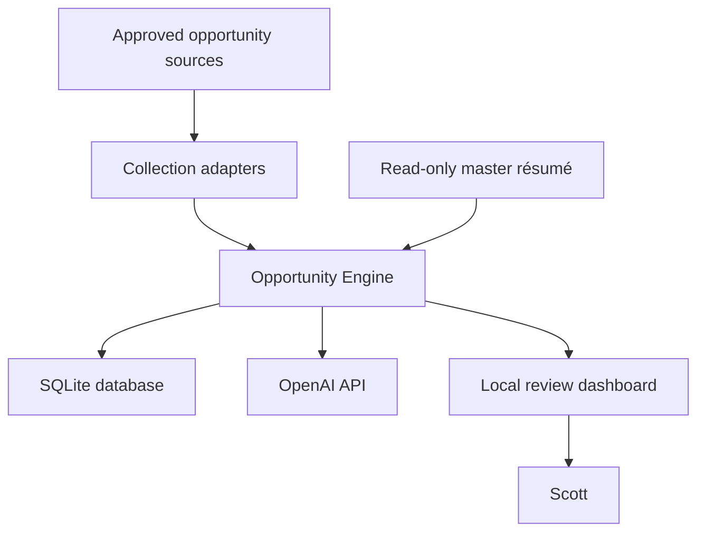
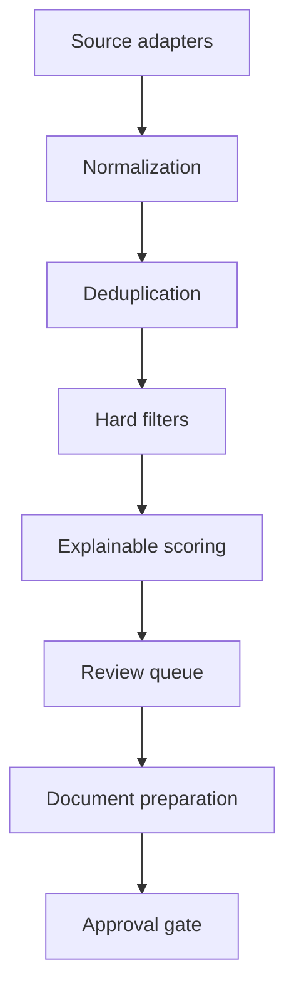

# OpportunityEngine Architecture

## 1. Document status

**Status:** Initial architecture baseline  
**Target:** v0.1 local, single-user MVP  
**Deployment target:** Linux Mint, with Docker support  
**Governing policy:** `config/constitution.json`

This document describes the intended system shape. It does not authorize implementation of the backend; implementation remains gated by Scott's approval of Issue #3.

## 2. Architectural goals

OpportunityEngine must:

1. Find relevant opportunities without optimizing for raw job volume.
2. Apply deterministic hard constraints before AI scoring.
3. Explain why an opportunity passed, failed, or received a score.
4. Preserve source evidence and decision history.
5. Keep the master résumé immutable.
6. Require explicit human approval before every external action.
7. Run locally with modest operational complexity.
8. Support incremental replacement of components as the project grows.

## 3. Constitutional boundaries

The constitution is a runtime policy source, not merely documentation.

### Always permitted internally

- Collecting approved opportunity data.
- Normalizing and deduplicating records.
- Applying hard filters.
- Scoring and explaining fit.
- Generating draft fit reports, résumés, and cover letters.
- Notifying Scott that an internal review item exists.

### Always approval-gated

- Applications.
- Email and external messages.
- Contracts.
- Identity verification.
- Financial commitments.

### Always prohibited

- Modifying the master résumé.
- Impersonating Scott.
- Treating an AI score as authorization.
- Silently weakening constitutional controls.
- Taking an external action when approval state is missing, ambiguous, expired, or invalid.

On uncertainty, the system must stop and request Scott's approval.

## 4. System context

External sources and AI providers supply information, not authority. Scott is the only decision authority.

## 5. Logical architecture

### 5.1 Source adapters

Each source integration implements a narrow adapter contract:

- Fetch records from one approved source.
- Preserve the source identifier, canonical URL, retrieval time, and raw payload.
- Return normalized input without embedding business decisions.
- Be idempotent when the same source record is collected repeatedly.
- Respect source terms, access controls, rate limits, and robots policies where applicable.

Source adapters must not score, apply, message, or generate application documents.

### 5.2 Normalization

Normalization maps source-specific data into the canonical opportunity model:

- Title and organization.
- Description and requirements.
- Work arrangement and location.
- Employment and engagement type.
- Compensation details.
- Schedule and availability expectations.
- Travel, relocation, and clearance requirements.
- Application URL and source timestamps.

The original source record remains available for traceability.

### 5.3 Deduplication

Deduplication uses layered evidence:

1. Exact source and external identifier.
2. Canonical URL.
3. Deterministic fingerprint of organization, title, location, and description.
4. Optional similarity review for likely duplicates.

Automatic deduplication decisions must retain the winning record, duplicate record, method, confidence, and explanation. Ambiguous matches remain separate or await review.

### 5.4 Hard-filter engine

Hard filters are deterministic and run before AI scoring. Initial rules come from the constitution:

- Remote only.
- No travel.
- No relocation.
- No existing security-clearance requirement.
- Must not replace Scott's full-time employment.

A failed hard filter records a machine-readable rule code and human-readable explanation. AI may extract evidence used by a rule, but it may not override the rule.

### 5.5 Scoring engine

The scoring engine operates only on opportunities that pass hard filters. Proposed dimensions include:

- Skill and experience alignment.
- Microsoft 365, AWS, infrastructure, systems-administration, and cybersecurity relevance.
- Contract, consulting, project, 1099, part-time, or after-hours fit.
- Compensation potential.
- Schedule compatibility.
- Requirement risk.
- Source and extraction confidence.

Each scoring run stores its engine version, model identifier, prompt version, input snapshot, component scores, total score, fit summary, concerns, and confidence. Re-scoring creates a new run rather than overwriting history.

### 5.6 Review workflow

The review queue presents evidence rather than making decisions. Scott can:

- Shortlist.
- Reject.
- Defer.
- Request a tailored application package.
- Approve or reject a specifically defined restricted action.

Approvals are scoped to one action and target. Approval for document generation is not approval to apply, send email, sign a contract, verify identity, or commit funds.

### 5.7 Document preparation

The master résumé is imported as immutable source material. Generated documents are new, versioned artifacts linked to an opportunity.

The generation service must:

- Ground claims in approved source material.
- Avoid inventing credentials, experience, dates, or outcomes.
- Flag uncertain or unsupported claims.
- Create a new tailored résumé rather than changing the master.
- Preserve prompt, model, source-version, and artifact history.

### 5.8 Notifications

Notifications inform Scott about internal review work. Initial notifications should remain local to the application. Any future external notification channel must be individually designed and approved.

A notification is not an application, outreach message, or authorization to communicate with a prospective client or employer.

## 6. Component model

### Web application

- **FastAPI:** HTTP API, validation, orchestration, and local web delivery.
- **Jinja2 and Bootstrap:** server-rendered dashboard for the initial MVP.
- **Pydantic:** request, response, configuration, and internal contract validation.
- **SQLAlchemy:** persistence abstraction and transaction management.

### Domain services

- Collection service.
- Normalization service.
- Deduplication service.
- Filter service.
- Scoring service.
- Review service.
- Document service.
- Approval service.
- Notification service.
- Audit service.

Business rules belong in domain services, not route handlers, templates, or source adapters.

### Persistence

SQLite is the v0.1 database. The schema uses conventional relational structures, foreign keys, indexes, constrained status values, and append-only history where appropriate.

PostgreSQL is a possible later migration, not an MVP requirement. Application code should avoid unnecessary SQLite-specific assumptions, while the initial schema may use SQLite protections and pragmas.

### Background work

The initial deployment should favor operational simplicity:

- Manual collection runs during early development.
- A single process-safe task runner or CLI command for repeatable jobs.
- cron or systemd timers only after jobs are idempotent and observable.
- No distributed queue until workload proves it necessary.

## 7. Data architecture

Primary records include:

- Sources and collection runs.
- Raw source records.
- Canonical opportunities.
- Opportunity-source links.
- Deduplication decisions.
- Filter evaluations.
- Scoring runs and score components.
- Résumé source versions.
- Generated documents.
- Review decisions.
- Approval requests.
- Notifications.
- Audit events.

Rules:

- Source evidence is preserved.
- Historical evaluations are append-only.
- Generated artifacts are versioned.
- Approval records identify actor, action, target, scope, and time.
- Audit events never contain secrets or complete sensitive documents.

The initial physical design is documented in `database/schema.sql`. The
applied schema is defined by SQLAlchemy models in `backend/db/models.py`
and created via the Alembic migrations in `database/migrations/`; see
`OE-ADR-014`.

## 8. API boundary

The exact API contract will be approved in Issue #3. The likely resource boundaries are:

- `/health`
- `/opportunities`
- `/collection-runs`
- `/evaluations`
- `/scoring-runs`
- `/documents`
- `/approvals`
- `/notifications`
- `/audit-events`

These are architectural candidates, not a committed endpoint contract.

## 9. AI boundary

OpenAI integration is isolated behind a provider interface. Domain code must not depend directly on a specific model name.

Every AI-assisted result records:

- Provider and model.
- Prompt-template version.
- Input reference or safe digest.
- Output payload.
- Parse and validation status.
- Token or cost metadata when available.
- Timestamp and correlation identifier.

AI output is untrusted input until validated. Deterministic code enforces hard filters, state transitions, authorization, and external-action gates.

## 10. Security model

### Initial threat assumptions

- The application runs for one user on a trusted Linux Mint workstation.
- Opportunity descriptions and web content are untrusted.
- Generated text may contain hallucinations or prompt-injection content.
- API keys and résumé content are sensitive.
- Local compromise remains possible and must not be ignored.

### Required controls

- Secrets supplied through environment variables or a local secret mechanism; never committed.
- Bind locally by default.
- Validate all external inputs.
- Escape rendered content.
- Use parameterized persistence through SQLAlchemy.
- Restrict uploaded file types and sizes.
- Prevent path traversal for generated artifacts.
- Log security and approval events.
- Redact secrets and sensitive document content from logs.
- Treat source content as data, never instructions.
- Pin and scan dependencies.
- Back up the database and generated artifacts.

### Authentication

The v0.1 authentication decision remains open for Issue #3. A loopback-only single-user deployment may use a simpler model than a network-accessible deployment. The application must not be exposed beyond the trusted host until authentication, TLS, and deployment controls are explicitly approved.

## 11. Auditability

Every important decision receives a correlation identifier. The audit trail should cover:

- Collection start and completion.
- Normalization failures.
- Duplicate decisions.
- Filter pass and fail results.
- Scoring runs.
- Manual review decisions.
- Document generation.
- Approval request and resolution.
- Notification delivery.
- Configuration or constitution-version changes observed by the application.

Audit records are append-only at the application and database layers.

## 12. Observability

The MVP should provide:

- Structured application logs.
- Correlation IDs.
- Job duration and result counts.
- Source failure and retry counts.
- Filter and scoring distributions.
- AI request latency and estimated cost.
- Pending-review and failed-task counts.
- Health and readiness status.

Operational failures must be visible in the dashboard or logs; silent failure is unacceptable.

## 13. Deployment

### Native Linux Mint

- Python virtual environment.
- FastAPI application managed by systemd.
- SQLite database and artifacts stored outside the source tree.
- Nginx only if needed for local reverse proxying.
- systemd timers or cron for approved scheduled collection.
- Explicit backup locations and retention.

### Docker

- Application container.
- Bind-mounted persistent data and artifact directories.
- Environment-based secrets.
- Health check.
- Localhost-only published port by default.
- Optional Nginx container only when justified.

Docker Compose remains a deployment convenience, not a substitute for configuration, backup, or security design.

## 14. Testing strategy

- Unit tests for normalization, fingerprints, filters, scoring math, and state transitions.
- Contract tests for source adapters.
- Integration tests against a temporary SQLite database.
- Golden tests for AI parsing and document generation.
- Security tests for prompt injection, unsafe claims, path handling, and approval bypass.
- Migration tests for schema upgrades.
- End-to-end tests for the internal review workflow.

No test may require a real external application, email, contract, identity check, or financial action.

## 15. Failure handling

- Collection failures retain run state and diagnostic context.
- Parsing failures preserve the raw source record.
- AI failures do not bypass filters or approvals.
- Database writes use transactions.
- Retried jobs must be idempotent.
- Partial document generation produces no approved artifact.
- Missing approval always fails closed.
- Constitution load or validation failure prevents restricted workflows from running.

## 16. Evolution principles

- Begin as a modular monolith.
- Prefer explicit contracts over premature microservices.
- Add infrastructure only when a measured requirement demands it.
- Preserve migration paths through clean service and repository boundaries.
- Version prompts, schemas, documents, and policy.
- Record important changes in `docs/DECISIONS.md`.
